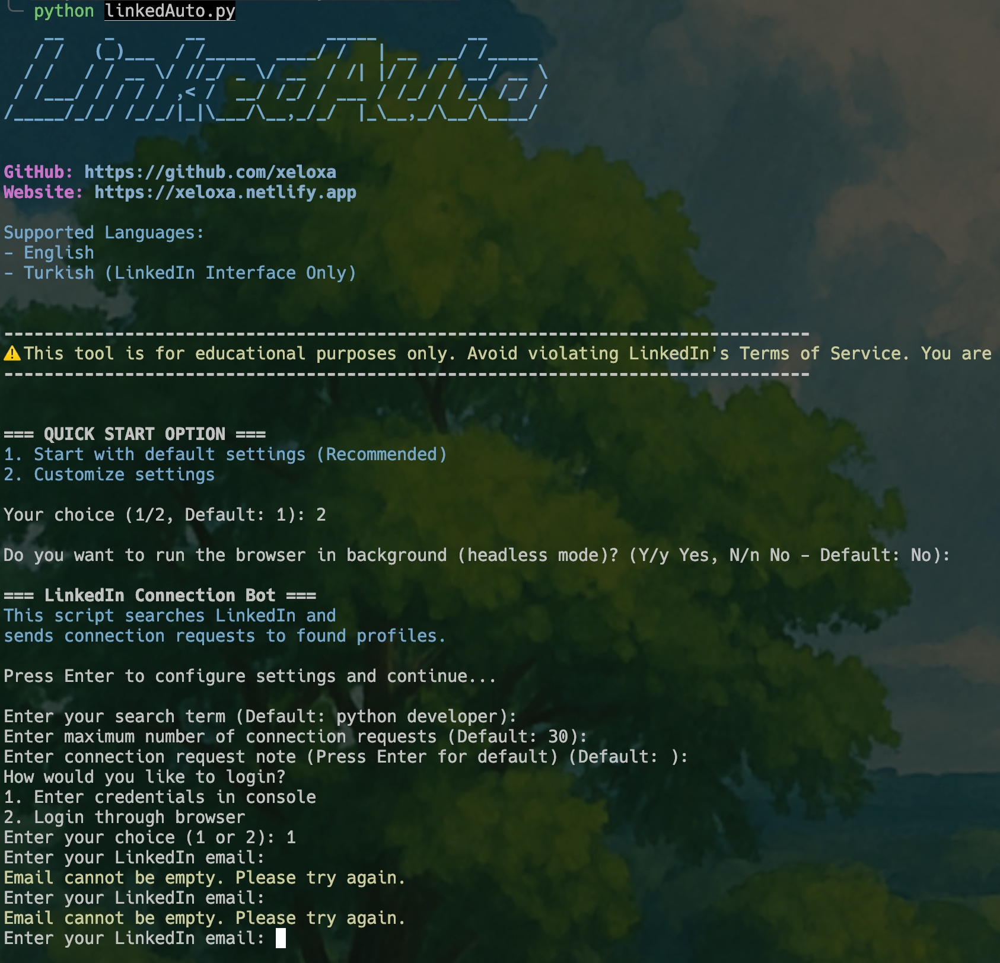

This tool is a Python script that allows you to automatically send connection requests on LinkedIn. You can search with your specified keywords and send connection requests from the search results.

## Features

- Automatic LinkedIn login (via console or browser)
- 2FA (Two-Factor Authentication) support
- Customizable connection notes
- Send connection requests from search results
- Weekly connection limit control
- Colored console output and logging
- Headless mode support
- Automatic ChromeDriver management
- Multi-platform support (Windows, macOS, Linux)
- Multi-language support (English, Turkish)

### Screenshots



## Prerequisites

- Python 3.7 or higher
- Chrome browser
- LinkedIn account

## Installation

1. Clone or download the project:
   ```bash
   git clone https://github.com/xeloxa/linkedauto.git
   cd linkedauto
   ```

2. Create and activate a virtual environment:
   ```bash
   # macOS/Linux
   python3 -m venv venv
   source venv/bin/activate

   # Windows
   python -m venv venv
   .\venv\Scripts\activate
   ```

3. Install required packages:
   ```bash
   pip install -r requirements.txt
   ```

## Usage

1. Run the script:
   ```bash
   python linkedAuto.py
   ```

2. Follow the on-screen instructions:

---

## Program Operation and Security

This tool operates using the official LinkedIn web interface and includes the following security features:

### Secure Authentication
- **Password Security**: User passwords are never stored or transmitted externally. They are securely entered in each session.
- **2FA Support**: Two-factor authentication (2FA) is supported and encouraged for secure login.
- **Session Management**: A new browser session is started with each run and cleaned up when finished.

### Data Privacy
- **Local Processing**: All operations are performed on the user's own computer. No data is sent to external servers.
- **Cookies and Cache**: All cookies and cache are cleared when the browser session is closed.
- **Log Records**: Only basic operations are logged for debugging purposes, sensitive information is not recorded.

### Technical Details
- **Selenium WebDriver**: Industry-standard Selenium WebDriver is used for browser automation.
- **Chrome Browser Integration**: Uses the user's installed Chrome browser to mimic a real user experience.
- **Error Management**: Exits safely and cleans up resources in unexpected situations.

## Common Issues

- **Chrome version incompatibility**: `webdriver-manager` should automatically install the correct ChromeDriver version. If you encounter issues, update your Chrome browser.
- **Login failure**: If 2FA is enabled, you may need to enter a verification code during login. (Encountered in headless mode.)
- **Connection requests not sending**: You may have reached LinkedIn's weekly connection limit. Wait a while and try again.

## Roadmap
- To be added.

## License

This project is licensed under the MIT License. See the `LICENSE` file for more information.

## Contributing

We welcome pull requests for bug fixes and new features. Please open an issue first to discuss what you would like to change.

## ⚠️ Important Warning

This tool is for educational purposes only. Avoid violating LinkedIn's Terms of Service. You are responsible for any consequences that may arise from using this tool.